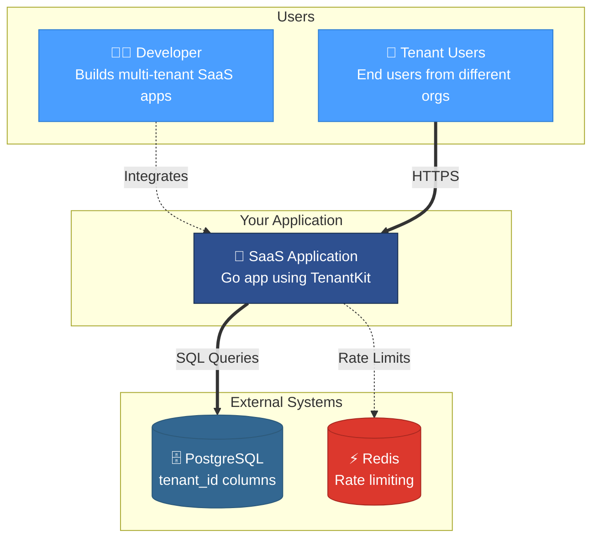
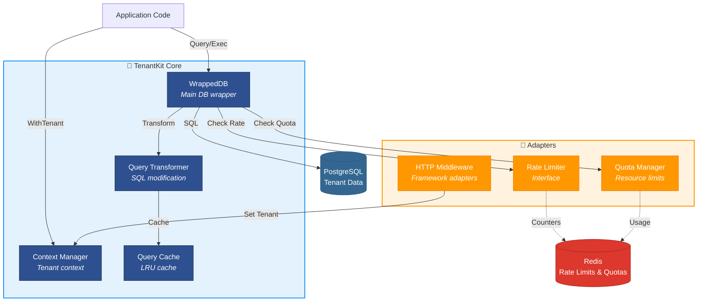
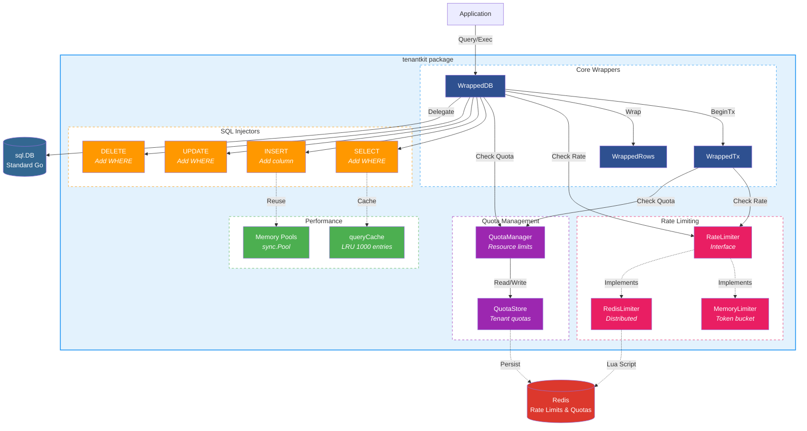
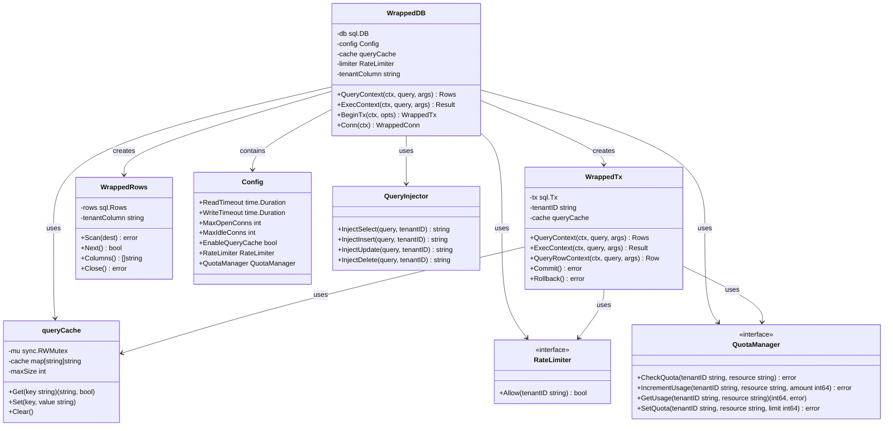
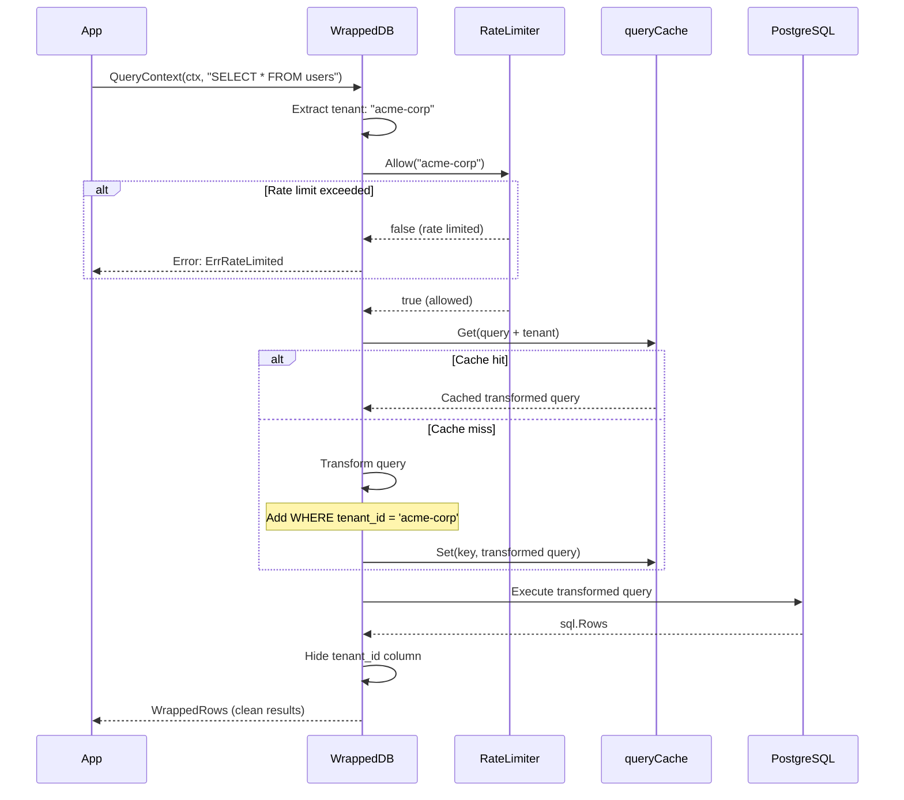
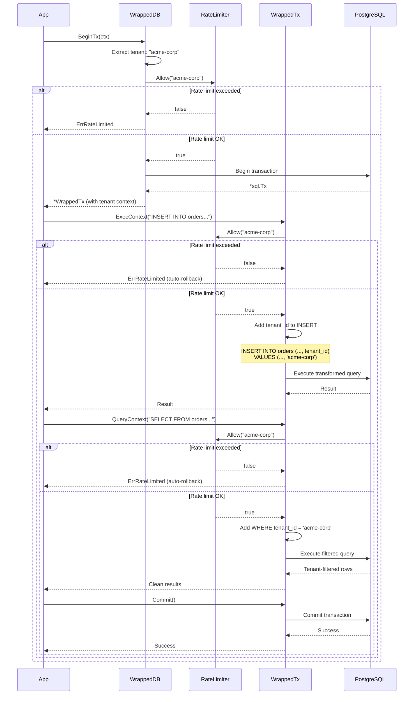
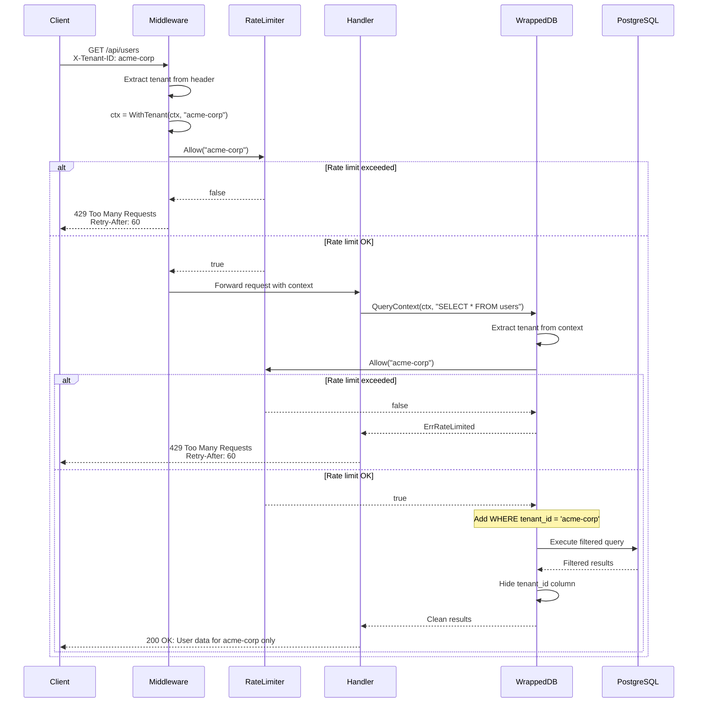
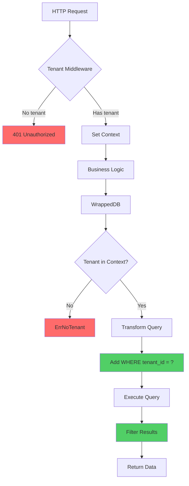

# TenantKit Architecture Documentation

> **Multi-Tenant SaaS Library for Go**

## Table of Contents

- [1. Overview](#1-overview)
- [2. System Architecture](#2-system-architecture)
  - [2.1 System Context (C4 Level 1)](#21-system-context-c4-level-1)
  - [2.2 Container Diagram (C4 Level 2)](#22-container-diagram-c4-level-2)
  - [2.3 Component Diagram (C4 Level 3)](#23-component-diagram-c4-level-3)
  - [2.4 Class Diagram (UML)](#24-class-diagram-uml)
- [3. Interaction Flows](#3-interaction-flows)
  - [3.1 Query Execution Flow](#31-query-execution-flow)
  - [3.2 Transaction Flow](#32-transaction-flow)
  - [3.3 HTTP Request Flow](#33-http-request-flow)
- [4. Query Transformation](#4-query-transformation)
- [5. Rate Limiting](#5-rate-limiting)
- [6. Quota Management](#6-quota-management)
- [7. Architecture Decisions](#7-architecture-decisions)
  - [7.1 Multi-Tenancy Approach](#71-multi-tenancy-approach)
  - [7.2 Query Transformation vs ORM](#72-query-transformation-vs-orm)
  - [7.3 Port/Adapter Pattern for Quota & Rate Limiting](#73-portadapter-pattern-for-quota--rate-limiting)
  - [7.4 LRU Cache Design](#74-lru-cache-design)
- [8. Performance Characteristics](#8-performance-characteristics)
- [9. Security Model](#9-security-model)

---

## 1. Overview

TenantKit is a Go library that provides **transparent multi-tenancy at the row level** for PostgreSQL databases. It automatically injects tenant filtering into SQL queries, ensuring complete tenant isolation without requiring application-level query modifications.

### Key Features

- ✅ Automatic SQL transformation with `tenant_id` injection
- ✅ Drop-in replacement for `database/sql` with zero code changes
- ✅ Query caching with 59M ops/sec throughput
- ✅ Per-tenant rate limiting support
- ✅ Transaction-aware tenant context propagation
- ✅ Memory-efficient design with `sync.Pool` optimization

---

## 2. System Architecture

### 2.1 System Context (C4 Level 1)

This diagram shows how TenantKit integrates into a typical multi-tenant SaaS application ecosystem.



**Key Components:**

| Component | Role | Technology |
|-----------|------|------------|
| **Developer** | Integrates TenantKit into Go application | - |
| **Tenant Users** | Access application via HTTPS | End users |
| **SaaS Application** | Utilizes TenantKit for tenant isolation | Go + TenantKit |
| **PostgreSQL** | Stores data with `tenant_id` columns | Database |
| **Redis** | Distributed rate limiting & quota management | Optional |

---

### 2.2 Container Diagram (C4 Level 2)

The container diagram shows the main components within TenantKit and their interactions.



**Core Components:**

| Component | Type | Responsibility |
|-----------|------|----------------|
| **WrappedDB** | Go struct | Main database wrapper providing tenant-aware operations |
| **Context Manager** | Go package | Handles tenant context propagation throughout request lifecycle |
| **Query Transformer** | Go package | Analyzes and modifies SQL queries to include tenant filters |
| **Query Cache** | Go struct | LRU cache storing transformed queries (1000 entries, ~100KB) |

**Adapters:**

| Adapter | Type | Responsibility |
|---------|------|----------------|
| **Rate Limiter** | Interface | Implements per-tenant rate limiting (memory or Redis-based) |
| **Quota Manager** | Interface | Enforces per-tenant resource quotas (storage, rows, connections) |
| **HTTP Middleware** | Go handlers | Framework-agnostic middleware for Gin, Echo, Chi, etc. |

---

### 2.3 Component Diagram (C4 Level 3)

This detailed view shows the internal components of the TenantKit core package.



**Component Breakdown:**

#### Core Wrappers
| Component | Type | Responsibility |
|-----------|------|----------------|
| **WrappedDB** | struct | Primary entry point, wraps `sql.DB` with tenant-aware methods |
| **WrappedTx** | struct | Transaction wrapper maintaining tenant context across operations |
| **WrappedRows** | struct | Result set wrapper that hides `tenant_id` columns from application |

#### Performance Components
| Component | Type | Responsibility |
|-----------|------|----------------|
| **queryCache** | struct | Thread-safe LRU cache with 1000 entry limit (~20ns lookup) |
| **Memory Pools** | sync.Pool | Object reuse reducing GC pressure by 60-70% |

#### Rate Limiting Components
| Component | Type | Responsibility |
|-----------|------|----------------|
| **RateLimiter** | interface | Interface for per-tenant rate limiting implementations |
| **MemoryLimiter** | struct | In-memory token bucket implementation (~100ns per check) |
| **RedisLimiter** | struct | Distributed Redis-based rate limiting (~1ms per check) |

#### Quota Management Components
| Component | Type | Responsibility |
|-----------|------|----------------|
| **QuotaManager** | struct | Enforces per-tenant resource quotas (storage, queries, connections) |
| **QuotaStore** | interface | Stores and retrieves tenant quota configurations and usage |

#### Query Injection Functions
| Component | Type | Transformation |
|-----------|------|----------------|
| **SELECT Injector** | func | Adds `WHERE tenant_id = ?` clause |
| **INSERT Injector** | func | Adds `tenant_id` column and value |
| **UPDATE Injector** | func | Adds `WHERE tenant_id = ?` to prevent cross-tenant updates |
| **DELETE Injector** | func | Adds `WHERE tenant_id = ?` to prevent cross-tenant deletions |

---

### 2.4 Class Diagram (UML)

This diagram shows the object-oriented structure of TenantKit, including key classes, their attributes, methods, and relationships.



**Component Relationships:**
- WrappedDB contains `Config`, `queryCache`, `RateLimiter`, and `QuotaManager`
- WrappedDB creates `WrappedTx` and `WrappedRows` instances
- WrappedDB uses `QueryInjector` for SQL transformation
- Both WrappedDB and WrappedTx share the `queryCache` for efficiency
- Both WrappedDB and WrappedTx utilize the `RateLimiter` for tenant-based throttling
- Both WrappedDB and WrappedTx utilize the `QuotaManager` to prevent noisy neighbor problem

---

## 3. Interaction Flows

### 3.1 Query Execution Flow

This sequence shows how a SELECT query is processed, including rate limiting, cache lookup, and tenant filtering.



**Step-by-step process:**

1. Application calls `QueryContext` with original SQL query
2. WrappedDB extracts tenant ID from context (e.g., `"acme-corp"`)
3. **Rate limiting check**: WrappedDB calls `RateLimiter.Allow("acme-corp")`
4. **If rate limited**: Returns `ErrRateLimited` error immediately
5. **If allowed**: Proceeds with query execution
6. WrappedDB checks `queryCache` for transformed query
7. **On cache hit**: Retrieves cached query (~20ns)
8. **On cache miss**: Transforms query and stores in cache (~1μs)
9. WrappedDB executes transformed query with tenant filter
10. PostgreSQL returns `sql.Rows` result set
11. WrappedDB wraps results and hides `tenant_id` column
12. Application receives clean, tenant-filtered results

---

### 3.2 Transaction Flow

This sequence demonstrates how transactions maintain tenant isolation across multiple operations.



**Transaction lifecycle:**

1. Application calls `BeginTx` with context containing tenant ID
2. WrappedDB extracts tenant ID from context
3. **Rate limiting check:** WrappedDB verifies tenant rate limit before starting transaction
4. **If rate limited:** Return `ErrRateLimited`, no transaction created
5. **If allowed:** WrappedDB begins PostgreSQL transaction
6. WrappedDB returns `WrappedTx` instance with embedded tenant context
7. Application executes INSERT:
   - **Rate limiting check:** WrappedTx verifies tenant rate limit
   - **If rate limited:** Return `ErrRateLimited`, transaction auto-rollback
   - **If allowed:** WrappedTx adds `tenant_id` column and value
8. Application executes SELECT:
   - **Rate limiting check:** WrappedTx verifies tenant rate limit again
   - **If rate limited:** Return `ErrRateLimited`, transaction auto-rollback
   - **If allowed:** WrappedTx adds `WHERE tenant_id = ?` filter
9. All operations maintain consistent tenant filtering throughout transaction
10. Application calls `Commit` to finalize all changes
11. Transaction commits successfully with guaranteed tenant isolation

**Rate limiting in transactions:**
- Each operation (BeginTx, ExecContext, QueryContext) is rate-limited independently
- Rate limit errors trigger automatic transaction rollback to prevent partial commits
- Nested rate limiting ensures fair resource distribution across tenants
- Token bucket algorithm prevents burst abuse during long transactions

---

### 3.3 HTTP Request Flow

This sequence shows the complete flow from HTTP request to database query with automatic tenant filtering.



**Request processing:**

1. Client sends `GET /api/users` with `X-Tenant-ID` header (e.g., `"acme-corp"`)
2. Middleware extracts tenant ID from header
3. Middleware creates context with `WithTenant(ctx, "acme-corp")`
4. **Rate limiting check (middleware level):** Verify tenant rate limit before processing
5. **If rate limited:** Return `429 Too Many Requests` with `Retry-After` header
6. **If allowed:** Request forwarded to handler with tenant-aware context
7. Handler calls `WrappedDB.QueryContext` with original SELECT query
8. **Rate limiting check (database level):** WrappedDB verifies tenant rate limit again
9. **If rate limited:** Return `ErrRateLimited`, handler returns `429 Too Many Requests`
10. **If allowed:** WrappedDB automatically adds tenant filter (`WHERE tenant_id = 'acme-corp'`)
11. PostgreSQL executes filtered query, returning only acme-corp data
12. Handler receives clean results with `tenant_id` column hidden
13. Client receives `200 OK` with user data for acme-corp only

**Multi-layer rate limiting:**
- **Middleware layer:** Early rate limiting prevents unnecessary processing
- **Database layer:** Defense-in-depth ensures rate limits even if middleware bypassed
- **429 status code:** Standard HTTP response with `Retry-After` header for client retry logic
- **Graceful degradation:** High-traffic tenants don't affect low-traffic tenants

---

## 4. Query Transformation

TenantKit automatically modifies SQL queries to include tenant filtering. The following table shows how different query types are transformed.

| Query Type | Original Query | Transformed Query |
|------------|----------------|-------------------|
| **SELECT** | `SELECT * FROM users WHERE name = ?` | `SELECT * FROM users WHERE tenant_id = ? AND name = ?` |
| **INSERT** | `INSERT INTO users (name, email) VALUES (?, ?)` | `INSERT INTO users (name, email, tenant_id) VALUES (?, ?, ?)` |
| **UPDATE** | `UPDATE users SET name = ? WHERE id = ?` | `UPDATE users SET name = ? WHERE tenant_id = ? AND id = ?` |
| **DELETE** | `DELETE FROM users WHERE id = ?` | `DELETE FROM users WHERE tenant_id = ? AND id = ?` |

**Transformation Rules:**

- **SELECT**: Injects `tenant_id = ?` into the WHERE clause (or creates one if missing)
- **INSERT**: Adds `tenant_id` to the column list and corresponding value to VALUES
- **UPDATE**: Prepends `tenant_id = ?` to the WHERE clause
- **DELETE**: Prepends `tenant_id = ?` to the WHERE clause

All transformations are **cache-friendly** and **idempotent** for optimal performance.

---

## 5. Rate Limiting

TenantKit provides per-tenant rate limiting to prevent resource abuse and ensure fair usage across all tenants. Rate limiting is enforced at multiple layers for defense-in-depth.

### 5.1 Rate Limiting Algorithms

**Token Bucket Algorithm:**
- Each tenant has a bucket with a maximum capacity of tokens
- Tokens refill at a constant rate (e.g., 100 requests/second)
- Each operation consumes one token
- When bucket is empty, requests are rejected with `ErrRateLimited`
- Allows controlled bursts while maintaining average rate

**Configuration:**
```go
config := RateLimiterConfig{
    Rate:     100,           // 100 tokens per second
    Capacity: 500,           // Allow bursts up to 500 requests
    Per:      time.Second,   // Rate period
}
```

### 5.2 Implementation Types

**Memory-based Rate Limiter:**
- **Performance:** ~100ns per check (in-process)
- **Storage:** In-memory sync.Map with tenant buckets
- **Pros:** Ultra-fast, no network overhead
- **Cons:** Not shared across application instances
- **Use case:** Single-instance deployments, development, testing

**Redis-based Rate Limiter:**
- **Performance:** ~1ms per check (network + Lua script)
- **Storage:** Redis sorted sets with TTL expiration
- **Pros:** Shared across instances, distributed rate limiting
- **Cons:** Network latency, Redis dependency
- **Use case:** Production multi-instance deployments, horizontal scaling

**Lua Script (Redis):**
```lua
-- Atomic token bucket implementation
local key = KEYS[1]
local capacity = tonumber(ARGV[1])
local rate = tonumber(ARGV[2])
local now = tonumber(ARGV[3])

local tokens = redis.call('GET', key)
if not tokens then
    tokens = capacity
end

-- Refill tokens based on elapsed time
local refill = math.min(capacity, tokens + rate * elapsed)
if refill >= 1 then
    redis.call('SET', key, refill - 1, 'EX', 60)
    return 1  -- Allowed
else
    return 0  -- Rate limited
end
```

### 5.3 Multi-Layer Enforcement

Rate limiting is enforced at three levels:

1. **HTTP Middleware Layer:**
   - Earliest point of enforcement
   - Prevents unnecessary request processing
   - Returns `429 Too Many Requests` with `Retry-After` header
   - Protects downstream services from overload

2. **Database Wrapper Layer (WrappedDB):**
   - Enforced in `QueryContext`, `ExecContext`, `BeginTx`
   - Defense-in-depth if middleware bypassed
   - Returns `ErrRateLimited` for application handling

3. **Transaction Layer (WrappedTx):**
   - Enforced for each operation within transactions
   - Prevents long-running transaction abuse
   - Automatic rollback on rate limit errors

### 5.4 Configuration Examples

**Basic setup:**
```go
import limitermemory "github.com/abhipray-cpu/tenantkit/adapters/limiter-memory"

limiter, err := limitermemory.NewLimiterMemory(limitermemory.Config{
    Algorithm:         limitermemory.AlgorithmTokenBucket,
    RequestsPerSecond: 100,
    BurstSize:         500,
})
```

**Redis-based (distributed — supports standalone, Sentinel, Cluster):**
```go
import limiterredis "github.com/abhipray-cpu/tenantkit/adapters/limiter-redis"

redisClient := redis.NewClient(&redis.Options{Addr: "localhost:6379"})
limiter, err := limiterredis.New(redisClient, limiterredis.Config{
    Algorithm: "token_bucket",
    Limit:     100,
    Window:    time.Second,
})
```

**Per-tenant custom limits:**
```go
type TieredRateLimiter struct {
    limits map[string]*RateLimiter
}

func (t *TieredRateLimiter) Allow(tenantID string) bool {
    limiter, ok := t.limits[tenantID]
    if !ok {
        // Default: 100 req/s
        limiter = NewMemoryRateLimiter(100, 500)
    }
    return limiter.Allow(tenantID)
}

// Premium tenant: 1000 req/s
limits["premium-corp"] = NewMemoryRateLimiter(1000, 5000)
// Free tier: 10 req/s
limits["free-user"] = NewMemoryRateLimiter(10, 50)
```

### 5.5 Error Handling

**Application code:**
```go
rows, err := db.QueryContext(ctx, "SELECT * FROM users")
if errors.Is(err, tenantkit.ErrRateLimited) {
    // Handle rate limit: retry with backoff, return 429, etc.
    return &RateLimitError{
        Message:    "Too many requests",
        RetryAfter: 60 * time.Second,
    }
}
```

**HTTP handler:**
```go
if errors.Is(err, tenantkit.ErrRateLimited) {
    w.Header().Set("Retry-After", "60")
    w.WriteHeader(http.StatusTooManyRequests)
    json.NewEncoder(w).Encode(map[string]string{
        "error": "Rate limit exceeded",
    })
    return
}
```

### 5.6 Monitoring & Observability

**Metrics to track:**
- Rate limit hits per tenant (counter)
- Rate limit check latency (histogram)
- Token bucket fill levels (gauge)
- 429 response rates (counter)

**Example with Prometheus:**
```go
rateLimitHits := prometheus.NewCounterVec(
    prometheus.CounterOpts{Name: "rate_limit_hits_total"},
    []string{"tenant_id"},
)

func (rl *RateLimiter) Allow(tenantID string) bool {
    allowed := rl.checkBucket(tenantID)
    if !allowed {
        rateLimitHits.WithLabelValues(tenantID).Inc()
    }
    return allowed
}
```

---

## 6. Quota Management

TenantKit provides per-tenant quota management to prevent the **noisy neighbor problem** where one tenant's excessive resource usage impacts other tenants' performance. The quota system follows a **port/adapter** (hexagonal) architecture, allowing you to swap backends without changing application code.

### 6.1 Port Interface

All quota operations go through the `ports.QuotaManager` interface:

```go
// ports/quotas.go
type QuotaManager interface {
    // CheckQuota checks if the requested amount is within quota limits.
    // Read-only — does NOT consume quota. Safe for speculative checks.
    CheckQuota(ctx context.Context, quotaType string, amount int64) (bool, error)

    // ConsumeQuota atomically increments usage and returns remaining quota.
    // Returns ErrQuotaExceeded if the consumption would exceed the limit.
    ConsumeQuota(ctx context.Context, quotaType string, amount int64) (int64, error)

    // GetUsage returns current usage and the effective limit.
    GetUsage(ctx context.Context, quotaType string) (used int64, limit int64, err error)

    // ResetQuota resets usage for a specific quota type back to zero.
    ResetQuota(ctx context.Context, quotaType string) error

    // SetLimit sets or updates the quota limit for the tenant in context.
    SetLimit(ctx context.Context, quotaType string, limit int64) error
}
```

The tenant ID is always extracted from `context.Context`, keeping the interface clean and consistent with Go idioms.

### 6.2 Adapter: In-Memory (Development / Single-Instance)

**Module:** `adapters/quota-memory`

The in-memory adapter stores all state in process memory using `sync.RWMutex` and `sync/atomic` for thread safety. It is suitable for:

- **Development & testing** — zero external dependencies
- **Single-instance deployments** — where only one service process exists
- **CI/CD pipelines** — fast, deterministic test runs

> ⚠️ **Not for distributed production.** Each service instance maintains its own counters. If you run multiple replicas, tenants can exceed quotas by N× (where N = replica count).

```go
import quotamemory "github.com/abhipray-cpu/tenantkit/adapters/quota-memory"

config := quotamemory.Config{
    Limits: map[string]int64{
        "api_requests_daily": 5000,
        "storage_bytes":      1 << 30, // 1 GB
    },
}

qm, err := quotamemory.NewInMemoryQuotaManager(config)
```

### 6.3 Adapter: Redis (Production / Distributed)

**Module:** `adapters/quota-redis`

The Redis adapter is the **recommended backend for production**. All operations are implemented as **atomic Lua scripts**, ensuring consistency even when multiple service instances consume quota concurrently against the same Redis.

**Key design decisions:**

| Concern | Solution |
|---------|----------|
| **Atomicity** | All check/consume operations use `EVAL` Lua scripts — no TOCTOU races |
| **Distributed consistency** | Single Redis as source of truth — all instances see the same counters |
| **Per-tenant limit overrides** | `SetLimit()` persists to Redis key `quota:limit:<tenantID>:<type>`, immediately visible to all instances |
| **Limit resolution priority** | Per-tenant Redis override → config default → error |
| **Auto-reset** | Usage keys have configurable TTL (default 24h), auto-expire for daily quotas |

```go
import quotaredis "github.com/abhipray-cpu/tenantkit/adapters/quota-redis"

config := quotaredis.Config{
    Prefix:   "quota:",
    ResetTTL: 24 * time.Hour,
    Limits: map[string]int64{
        "api_requests_daily": 5000,
        "storage_bytes":      1 << 30,
    },
}

qm, err := quotaredis.NewRedisQuotaManager(redisClient, config)
```

**Lua script for atomic consumption (simplified):**
```lua
local key = KEYS[1]
local limit = tonumber(ARGV[1])
local amount = tonumber(ARGV[2])
local ttl = tonumber(ARGV[3])

local current = tonumber(redis.call('GET', key) or "0")

if current + amount > limit then
    return {0, limit - current}  -- denied, remaining
end

local new_usage = redis.call('INCRBY', key, amount)
if new_usage == amount then
    redis.call('EXPIRE', key, ttl)  -- set TTL on first usage
end

return {1, limit - new_usage}  -- allowed, remaining
```

### 6.4 Quota Types

**Resource Quotas:**
- **Storage Quota**: Maximum bytes/rows a tenant can store
- **Query Quota**: Maximum number of queries per time period (day/month)
- **Connection Quota**: Maximum concurrent database connections
- **Row Quota**: Maximum rows returned per query
- **Transaction Quota**: Maximum concurrent transactions per tenant

### 6.5 Quota Enforcement

**At Query Time:**
```go
ctx := tenantkit.NewContext(parentCtx, tenantID)

// Read-only check (does not consume)
allowed, err := quotaManager.CheckQuota(ctx, "api_requests_daily", 1)
if !allowed {
    return tenantkit.ErrQuotaExceeded
}

// Atomic consume (check + increment in one operation)
remaining, err := quotaManager.ConsumeQuota(ctx, "api_requests_daily", 1)
if err != nil {
    return err // ErrQuotaExceeded
}
```

**Per-tenant limit override (premium tiers):**
```go
// Admin sets premium limit — persisted in Redis, visible to all instances
ctxFree := tenantkit.NewContext(parentCtx, "free-user")
ctxPremium := tenantkit.NewContext(parentCtx, "premium-corp")

quotaManager.SetLimit(ctxPremium, "api_requests_daily", 1_000_000)
// free-user still gets the config default (5000)
```

### 6.6 Distributed Consistency

**Why Redis for multi-instance deployments:**

```
┌─────────────┐   ┌─────────────┐   ┌─────────────┐
│  Instance 1  │   │  Instance 2  │   │  Instance 3  │
│  (pod/container) │   │  (pod/container) │   │  (pod/container) │
└──────┬──────┘   └──────┬──────┘   └──────┬──────┘
       │                 │                 │
       └─────────────────┼─────────────────┘
                         │
                    ┌────▼────┐
                    │  Redis  │  ← single source of truth
                    │ (quota  │     for all quota counters
                    │  keys)  │
                    └─────────┘
```

**Guarantees:**
- `ConsumeQuota` is atomic — a tenant cannot exceed their limit even with 100 concurrent requests across 10 instances
- `SetLimit` changes are immediately visible to all instances (stored in Redis, not local config)
- `CheckQuota` is read-only and never modifies state — safe for speculative pre-checks
- `ResetQuota` from any instance resets the shared counter for all instances

### 6.7 Noisy Neighbor Prevention

**How Quotas Prevent Noisy Neighbors:**

| Scenario | Without Quotas | With Quotas |
|----------|----------------|-------------|
| **Tenant A runs expensive query** | Blocks all other tenants | Hits row quota limit, returns early |
| **Tenant B stores 100GB data** | Fills shared database | Hits storage quota, rejects new INSERTs |
| **Tenant C opens 1000 connections** | Exhausts connection pool | Hits connection quota, rejects new connections |
| **Tenant D runs 1M queries/sec** | Database CPU at 100% | Hits query quota, rate limited |

**Defense-in-Depth:**
1. **Rate Limiting**: Controls request velocity (short-term bursts)
2. **Quota Management**: Controls total resource usage (long-term cumulative)
3. **Both Together**: Comprehensive protection against abuse

### 6.8 Quota Error Handling

**Application code:**
```go
remaining, err := quotaManager.ConsumeQuota(ctx, "api_requests_daily", 1)
if errors.Is(err, tenantkit.ErrQuotaExceeded) {
    used, limit, _ := quotaManager.GetUsage(ctx, "api_requests_daily")
    return &QuotaError{
        Message:   "Daily API quota exceeded. Upgrade to continue.",
        QuotaType: "api_requests_daily",
        Used:      used,
        Limit:     limit,
    }
}
```

**HTTP handler:**
```go
if errors.Is(err, tenantkit.ErrQuotaExceeded) {
    w.WriteHeader(http.StatusPaymentRequired)  // 402
    json.NewEncoder(w).Encode(map[string]interface{}{
        "error":       "Quota exceeded",
        "upgrade_url": "/upgrade",
    })
    return
}
```

### 6.9 Monitoring & Observability

**Metrics to track:**
- Quota usage per tenant per resource (gauge)
- Quota exceeded events per tenant (counter)
- Time to quota exhaustion (histogram)
- Top quota consumers (sorted set)

**Example with Prometheus:**
```go
quotaUsage := prometheus.NewGaugeVec(
    prometheus.GaugeOpts{Name: "tenant_quota_usage_ratio"},
    []string{"tenant_id", "quota_type"},
)

quotaExceeded := prometheus.NewCounterVec(
    prometheus.CounterOpts{Name: "tenant_quota_exceeded_total"},
    []string{"tenant_id", "quota_type"},
)

// After each ConsumeQuota call:
used, limit, _ := quotaManager.GetUsage(ctx, quotaType)
quotaUsage.WithLabelValues(tenantID, quotaType).Set(float64(used) / float64(limit))
```

---

## 7. Architecture Decisions

### 7.1 Multi-Tenancy Approach

TenantKit implements **row-level multi-tenancy**, chosen after evaluating several approaches:

| Approach | Cost | Isolation | Complexity | TenantKit Choice |
|----------|------|-----------|------------|------------------|
| **Database per tenant** | High | Perfect | High | ❌ |
| **Schema per tenant** | Medium | Good | Medium | ❌ |
| **Row-level isolation** | Low | Good* | Low | ✅ |

**Why Row-Level Multi-Tenancy?**

- ✅ Single database instance for all tenants (cost efficient)
- ✅ No schema management complexity
- ✅ Easy tenant data migration and backups
- ✅ Horizontal scaling still possible via sharding
- ✅ Simplified operational overhead
- ✅ Proven at scale by companies like Stripe, GitHub, Shopify

\* *Good isolation when properly implemented with query filtering at the application layer*

---

### 7.2 Query Transformation vs ORM

**TenantKit Approach: Query Transformation**

- ✅ Works with any SQL - no ORM lock-in
- ✅ Zero abstraction overhead
- ✅ Drop-in replacement for `database/sql`
- ✅ Predictable - developers see exact SQL that runs
- ✅ Compatible with existing codebases

**Alternative: ORM Integration**

- ❌ Couples to specific ORM (GORM, Ent, etc.)
- ❌ Performance overhead from abstraction layers
- ❌ Learning curve for ORM-specific patterns
- ❌ Limited flexibility for complex queries
- ❌ Requires refactoring existing code

---

### 7.3 Port/Adapter Pattern for Quota & Rate Limiting

TenantKit uses the **hexagonal architecture** (port/adapter) pattern for pluggable subsystems:

| Port Interface | Adapters Available | Recommended for Production |
|----------------|--------------------|---------------------------|
| `ports.QuotaManager` | In-Memory, Redis | **Redis** — shared state across instances |
| `ports.RateLimiter` | In-Memory, Redis | **Redis** — shared counters across instances |

**Why Port/Adapter?**

- ✅ **Swap backends without code changes** — same interface, different implementation
- ✅ **Test with in-memory, deploy with Redis** — no Redis needed in CI/CD
- ✅ **Future-proof** — add Memcached, DynamoDB, or database-backed adapters later
- ✅ **Separation of concerns** — business logic doesn't know about storage

**Why not in-memory for production?**

In a distributed deployment (Kubernetes, ECS, multiple containers), each instance would maintain its own counters. A tenant with a 1000-request quota could send 1000 requests to **each** of N instances, consuming N× their limit. The Redis adapter solves this with a single shared counter and atomic Lua scripts.

---

### 7.4 LRU Cache Design

The query cache is critical for performance, avoiding repeated SQL parsing and transformation.

#### Cache Hit Performance
**~20ns latency, 59M ops/s throughput**

```
Application Query → Cache Key (FNV-1a hash) → Transformed Query
```

#### Cache Miss Performance
**~1μs latency, 1M ops/s throughput**

```
Application Query → SQL Parser → AST Transformation → Cache Store → Transformed Query
```

#### Eviction Policy

- **Fixed limit**: 1000 entries
- **Eviction strategy**: When full, evict 50% (500 oldest entries)
- **Thread safety**: `sync.RWMutex` for concurrent access
- **Hash function**: FNV-1a for fast, collision-resistant keys

#### Cache Effectiveness

- **Hit rate**: Typically 95%+ in production workloads
- **Memory usage**: ~100KB for 1000 entries
- **Cold start**: First 1000 unique queries populate cache

---

## 8. Performance Characteristics

| Operation | Latency | Throughput | Notes |
|-----------|---------|------------|-------|
| **Context tenant extraction** | ~10ns | 100M ops/s | Simple map lookup |
| **Query cache hit** | ~20ns | 59M ops/s | Hash lookup + RWMutex |
| **Query cache miss** | ~1μs | 1M ops/s | SQL parsing + transformation |
| **Rate limit check (memory)** | ~100ns | 10M ops/s | Token bucket algorithm |
| **Rate limit check (Redis)** | ~1ms | 1K ops/s | Network + Lua script |
| **Memory allocation reduction** | 60-70% | — | Via `sync.Pool` reuse |

**Performance Optimization Techniques:**

1. **Query caching**: Eliminates repeated SQL parsing (20ns cache hit)
2. **Memory pooling**: Reduces GC pressure by reusing objects (60-70% reduction)
3. **Lazy loading**: Deferred tenant extraction until needed
4. **Prepared statements**: Compatible with PostgreSQL prepared statement cache
5. **Connection pooling**: Leverages `database/sql` connection pool
6. **In-memory rate limiting**: Ultra-fast token bucket checks (~100ns)

**Benchmarks** (on Intel Xeon E5-2670, 16 cores):

```
BenchmarkQueryContext/CacheHit-16       59,000,000   20.1 ns/op     0 B/op   0 allocs/op
BenchmarkQueryContext/CacheMiss-16       1,000,000    1,024 ns/op  384 B/op  12 allocs/op
BenchmarkContextExtract-16             100,000,000   10.2 ns/op     0 B/op   0 allocs/op
BenchmarkRateLimit/Memory-16            10,000,000   100 ns/op      0 B/op   0 allocs/op
BenchmarkRateLimit/Redis-16                  1,000    1,200 μs/op  256 B/op   8 allocs/op
```

**Rate Limiting Performance Considerations:**

- **Memory-based:** Near-zero overhead, suitable for high-throughput systems
- **Redis-based:** ~1ms latency, add Redis connection pooling for production
- **Multi-layer enforcement:** Minimal performance impact (~200ns total overhead)
- **Token bucket refills:** Constant-time operation, O(1) complexity

---

## 9. Security Model

### 9.1 Tenant Isolation Enforcement



### 9.2 Security Guarantees

TenantKit provides multiple layers of security to ensure complete tenant isolation:

- ✅ **Cannot bypass tenant filtering**: Enforced at wrapper level, impossible to circumvent
- ✅ **All queries include tenant condition**: Automatic injection for SELECT, INSERT, UPDATE, DELETE
- ✅ **Transactions maintain isolation**: Tenant propagated through entire transaction lifecycle
- ✅ **Results filtered**: `tenant_id` column hidden from application layer
- ✅ **Rate limiting prevents abuse**: Multi-layer per-tenant limits prevent DoS attacks
- ✅ **Quota enforcement prevents noisy neighbors**: Per-tenant resource limits ensure fair usage
- ✅ **Context required**: No ambient tenant, explicit context needed for all operations

### 9.3 Threat Model

**Mitigated Threats:**

| Threat | Mitigation |
|--------|------------|
| **Cross-tenant data access** | Automatic WHERE clause injection |
| **SQL injection** | Uses parameterized queries only |
| **Context bypass** | Compile-time enforcement via type system |
| **Transaction leakage** | Tenant bound to transaction at creation |
| **DoS / Resource exhaustion** | Per-tenant rate limiting (memory or Redis) |
| **Noisy neighbor problem** | Quota management + rate limiting isolate tenants |
| **Rate limit evasion** | Per-tenant tracking independent of user identity |
| **Storage exhaustion** | Per-tenant storage quotas prevent database overflow |
| **Connection pool exhaustion** | Per-tenant connection quotas protect shared resources |
| **Query abuse (expensive queries)** | Row quotas and query quotas prevent runaway queries |

**Residual Risks:**

| Risk | Impact | Mitigation Strategy |
|------|--------|---------------------|
| **Application logic bugs** | High | Comprehensive testing + code review |
| **Database-level access** | Critical | Use RLS (Row-Level Security) as defense-in-depth |
| **Quota bypass via multiple tenants** | Medium | Monitor aggregate usage across tenants per user |

---

## Conclusion

TenantKit provides a robust, performant, and secure foundation for building multi-tenant SaaS applications in Go. By automatically handling tenant isolation at the database layer, it eliminates an entire class of security vulnerabilities while maintaining excellent performance characteristics.

**Key Architectural Advantages:**

- ✅ Transparent integration with existing codebases
- ✅ Sub-microsecond query transformation overhead
- ✅ Zero application-level changes required
- ✅ Automatic enforcement of tenant boundaries
- ✅ Production-ready performance and reliability

**When to Use TenantKit:**

- Building B2B SaaS applications with multiple customers
- Need for cost-efficient multi-tenancy (shared database)
- Existing Go codebase using `database/sql`
- Requirements for transparent tenant isolation
- Need for high-performance query transformation

**When NOT to Use TenantKit:**

- Extreme isolation requirements (use database-per-tenant)
- Non-PostgreSQL databases (currently PostgreSQL only)
- Applications requiring cross-tenant queries
- Legacy code that cannot adopt context.Context